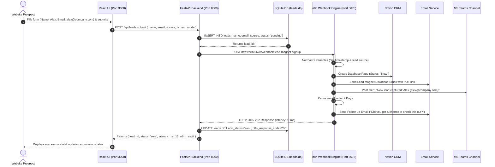

# 🚀 n8n Lead Magnet Funnel & CRM Automation Portal

> A high-performance, open-source lead capture, CRM synchronization, and multi-channel automated funnel system built with **React**, **FastAPI**, **SQLite**, and **n8n Workflow Automation**.

---

## 📌 Executive Summary: What Does This System Do?

This project provides a complete end-to-end **Lead Generation & Business Automation Engine**. 

When a prospective client or customer visits your website and requests a free resource (such as an E-book, Whitepaper, Product Guide, or Demo), this system instantly captures their information, validates it, logs it into a central database, triggers an automated multi-stage marketing funnel, notifies your sales team, and handles automated follow-ups.

### 🔄 The Automated Journey of a Lead:
1. **Capture**: A prospect submits their name and email on your frontend form.
2. **Local Staging & Resilience**: FastAPI immediately saves the lead into a local SQLite database (`leads.db`) so **no lead is ever lost**, even if downstream services or internet connections fail.
3. **Instant Delivery**: The system fires a webhook to n8n, which sends the lead magnet (PDF/guide download link) directly to the lead's inbox within seconds.
4. **CRM Logging**: The lead is automatically created as a record in **Notion CRM** with status set to `"New"`.
5. **Internal Sales Notification**: Your sales team receives a real-time alert in **Microsoft Teams** with the lead's details so they can reach out if needed.
6. **Automated Follow-Up**: The n8n engine pauses execution for 2 days, then automatically sends a targeted follow-up email encouraging the prospect to book a discovery call.

---

## 🎯 Target Audience: Who Is This System Built For?

This solution is engineered for businesses and teams looking for enterprise-grade marketing automation without expensive SaaS subscription fees:

- **B2B Companies & SaaS Startups**: Automatically deliver free trial guides or product whitepapers, update CRM records, and ping sales reps on Teams instantly.
- **Digital Marketing & Growth Agencies**: Deploy a standardized, reusable lead capture infrastructure across client campaigns with full observability.
- **Course Creators & Solopreneurs**: Offer free mini-courses or cheat sheets while keeping track of every single subscriber.
- **Sales & Revenue Operations Teams**: Eliminate manual copy-pasting of leads from forms into Notion CRM or chat apps.
- **Developers & Automation Engineers**: A clean, scalable reference architecture combining React, FastAPI, SQLite, Docker, and self-hosted n8n.

---

## 💎 Key Advantages & Business Benefits

| Advantage | Why It Matters |
| :--- | :--- |
| 🛡️ **Zero Data Loss Architecture** | Traditional webhooks fail silently if n8n or third-party APIs go down. Our FastAPI backend stages every lead in a local SQLite database **before** calling n8n, ensuring 100% data durability. |
| 💰 **Zero Zapier / Make Subscriptions** | Avoid per-task pricing models that get expensive as lead volume grows. Running self-hosted n8n + FastAPI costs a fraction of commercial iPaaS solutions. |
| ⚡ **Instant Lead Gratification** | Delivers lead magnets in seconds, boosting conversion rates and user satisfaction. |
| 📊 **Real-Time Observability & Latency Tracking** | The frontend portal displays exact HTTP status codes, latency in milliseconds, target webhook URLs, and raw response payloads for every submission. |
| 🧪 **Safe Test Mode Sandbox** | Includes a built-in toggle to test webhooks (`/webhook-test/...`) without cluttering production Notion CRM databases or firing live email sequences. |
| 🐳 **One-Click Containerized Deployment** | Runs fully Dockerized (`docker compose up -d`) with isolated containers for Frontend (3000), Backend (8000), and n8n (5678). |

---

## 📐 System Architecture & Workflow Diagram

```mermaid
flowchart TD
    subgraph Client ["Frontend Portal (React + Vite - Port 3000)"]
        UI["Lead Form & Real-Time Monitor"]
        VIZ["Pipeline Visualizer"]
        DB_VIEW["Submissions Log Table"]
    end

    subgraph Backend ["FastAPI Service (Python - Port 8000)"]
        API["FastAPI App (main.py)"]
        SQLITE[(SQLite DB\nleads.db)]
        SERVICE["n8n Service & Parser"]
    end

    subgraph Engine ["n8n Automation Engine (Port 5678)"]
        WH["1. Lead Webhook Node\n(/webhook/lead-magnet-signup)"]
        SET["2. Normalize Lead Data Node"]
        NOTION["3. Log Lead to Notion Node"]
        EMAIL1["4. Deliver Lead Magnet Email Node"]
        TEAMS["5. Notify Sales Team (Teams) Node"]
        WAIT["6. Wait 2 Days Node"]
        EMAIL2["7. Send Follow-up Email Node"]
    end

    subgraph External ["External Integrations"]
        NOTION_DB[("Notion CRM Database")]
        SMTP["SMTP / Gmail Server"]
        MS_TEAMS["Microsoft Teams Sales Channel"]
    end

    UI -->|1. Submit Form Data| API
    API -->|2. Save Lead (Pending)| SQLITE
    API -->|3. Trigger Webhook| WH
    WH --> SET
    SET --> NOTION
    NOTION -->|API Create Page| NOTION_DB
    NOTION --> EMAIL1
    EMAIL1 -->|Send Download Email| SMTP
    EMAIL1 --> TEAMS
    TEAMS -->|Post Channel Message| MS_TEAMS
    TEAMS --> WAIT
    WAIT -->|Pause 2 Days| EMAIL2
    EMAIL2 -->|Send Follow-up Email| SMTP

    API -->|4. Return Response & Latency| UI
    SERVICE -->|Read Config| SQLITE
```

---

## 🔄 End-to-End Sequence & Operational Protocol



---

## 🛠️ Detailed Node Breakdown (`data/node.json`)

The workflow file `data/node.json` defines the entire n8n execution pipeline:

### 1. **Lead Form Webhook** (`n8n-nodes-base.webhook`)
- **HTTP Method**: `POST`
- **Path**: `lead-magnet-signup`
- **Production Endpoint**: `http://localhost:5678/webhook/lead-magnet-signup`
- **Test Endpoint**: `http://localhost:5678/webhook-test/lead-magnet-signup`
- **Role**: Entry point receiving JSON payload `{ "name": "...", "email": "...", "source": "..." }`.

### 2. **Normalize Lead Data** (`n8n-nodes-base.set`)
- **Role**: Cleanses data and assigns standard fields:
  - `name`: `={{ $json.body.name }}`
  - `email`: `={{ $json.body.email }}`
  - `source`: `"Lead Magnet Funnel"`
  - `submittedAt`: `={{ $now.toISO() }}`

### 3. **Log Lead to Notion** (`n8n-nodes-base.notion`)
- **Operation**: `databasePage:create`
- **Target Database**: `YOUR_NOTION_DATABASE_ID`
- **Property Mapping**:
  - `Name` (title): `={{ $json.name }}`
  - `Email` (email): `={{ $json.email }}`
  - `Source` (rich_text): `={{ $json.source }}`
  - `Status` (select): `"New"`

### 4. **Deliver Lead Magnet Email** (`n8n-nodes-base.emailSend`)
- **Subject**: `"Here's your free guide!"`
- **Format**: HTML Email
- **Content**: Includes greeting, confirmation, and download link: `<a href="https://yourdomain.com/lead-magnet.pdf">Download your guide</a>`.

### 5. **Notify Sales Team (Teams)** (`n8n-nodes-base.microsoftTeams`)
- **Message**: `"New lead captured: {{ $json.name }} ({{ $json.email }}) — logged to Notion CRM and sent the lead magnet."`
- **Role**: Alert sales reps instantly in MS Teams.

### 6. **Wait 2 Days** (`n8n-nodes-base.wait`)
- **Duration**: `2 Days`
- **Role**: Delay node allowing prospect time to review the downloaded guide.

### 7. **Send Follow-up Email** (`n8n-nodes-base.emailSend`)
- **Subject**: `"Did you get a chance to check this out?"`
- **Content**: Follow-up email inviting lead to book a call: `<a href="https://yourdomain.com/book-a-call">Book a call</a>`.

---

## 📡 API Endpoint Reference

FastAPI runs on `http://localhost:8000`. Interactive Swagger docs available at `http://localhost:8000/docs`.

### `POST /api/leads/submit`
Submits lead, saves to SQLite DB, and triggers n8n webhook.
- **Request Body**:
  ```json
  {
    "name": "Sarah Connor",
    "email": "sarah@cyberdyne.com",
    "source": "Lead Magnet Funnel",
    "is_test_mode": false
  }
  ```
- **Response**:
  ```json
  {
    "lead_id": 1,
    "name": "Sarah Connor",
    "email": "sarah@cyberdyne.com",
    "status": "sent",
    "n8n_result": {
      "success": true,
      "status_code": 200,
      "latency_ms": 14.2,
      "target_url": "http://n8n:5678/webhook/lead-magnet-signup",
      "response": "Webhook triggered successfully"
    }
  }
  ```

### `GET /api/leads`
Retrieves all lead submission records stored in SQLite database.

### `GET /api/health`
Returns system status for FastAPI backend and connected n8n engine.

### `GET /api/workflow`
Parses `data/node.json` and exposes active status, setup checklist, and node definitions.

---

## 🐳 Docker Deployment & Architecture

The entire stack is containerized using `docker-compose.yml`:

```yaml
services:
  n8n:
    image: n8nio/n8n:latest
    ports: ["5678:5678"]

  backend:
    build: ./backend
    ports: ["8000:8000"]
    environment:
      - N8N_BASE_URL=http://n8n:5678

  frontend:
    build: ./frontend
    ports: ["3000:3000"]
```

### Commands:
```bash
# Launch multi-container stack
docker compose up --build -d

# View running services
docker compose ps

# View container logs
docker compose logs -f

# Stop containers
docker compose down
```

---

## 📋 Setup & Credential Checklist

1. **Webhook Registration**: Set form action to `http://localhost:5678/webhook/lead-magnet-signup`.
2. **Notion CRM Setup**: Create a Notion Database with columns (`Name`, `Email`, `Source`, `Status`) and replace `YOUR_NOTION_DATABASE_ID` in n8n.
3. **Email SMTP Setup**: Configure SMTP credentials in n8n for outgoing lead magnet & follow-up emails.
4. **Microsoft Teams**: Authenticate Microsoft Teams OAuth2 in n8n and choose your team channel.
5. **Activate Workflow**: Open n8n UI at `http://localhost:5678` and set workflow to **Active**.
